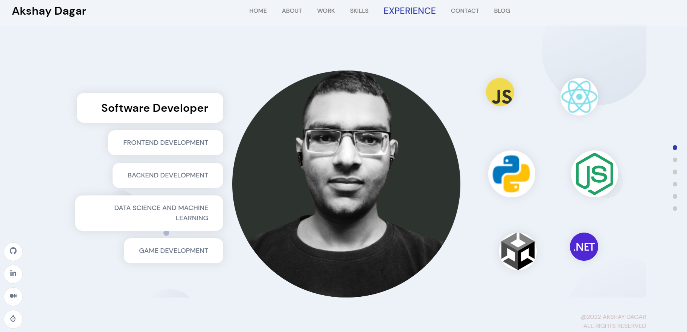

# This is my personal portfolio application
##### Build using React, Framer Motion, and sanity cms as the backend. Deployed using Netlify.

### To run locally:
1. Clone this repo
2. Create a new project on sanity cms and create a .env file like in .env.example
3. cd frontend -> npm start
4. cd backend -> npm start